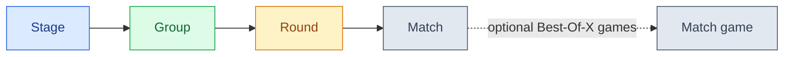
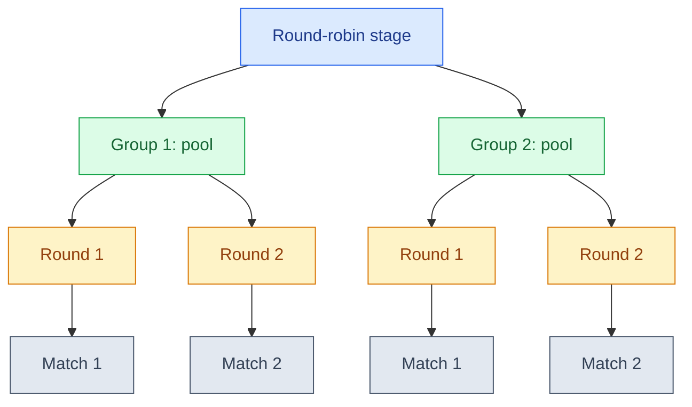
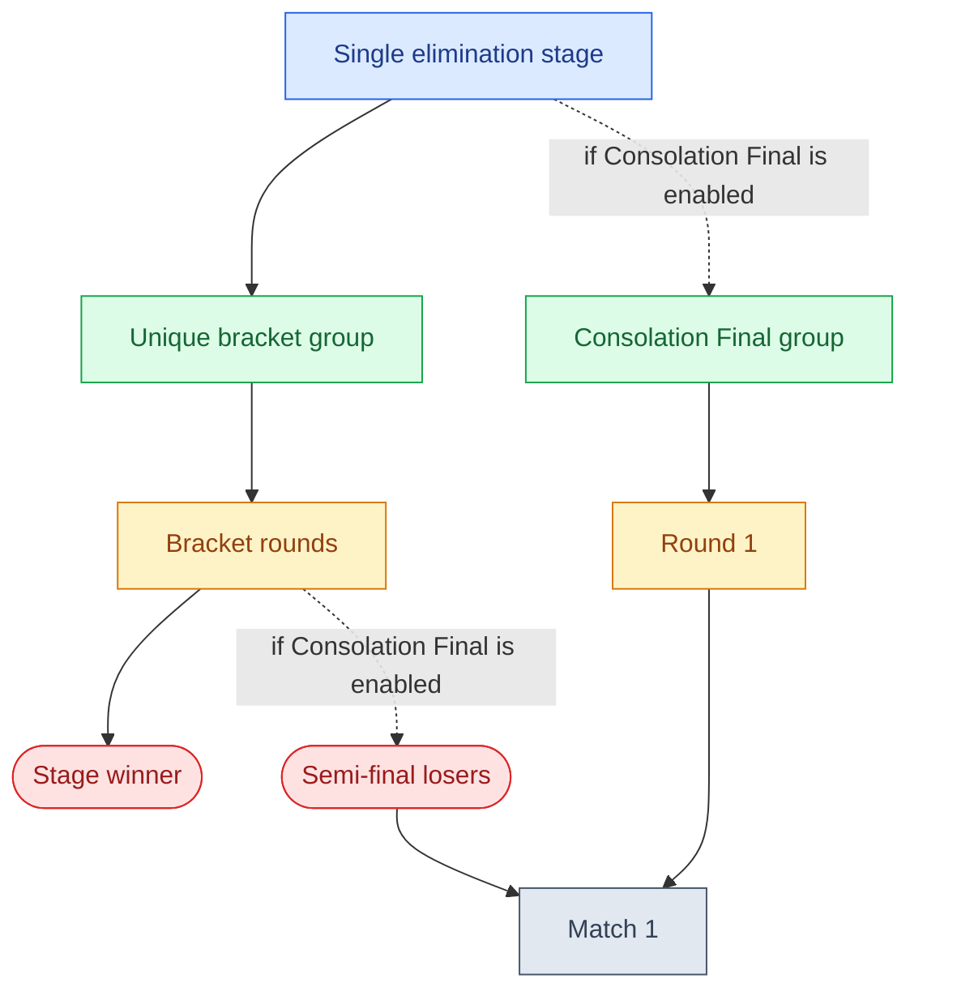
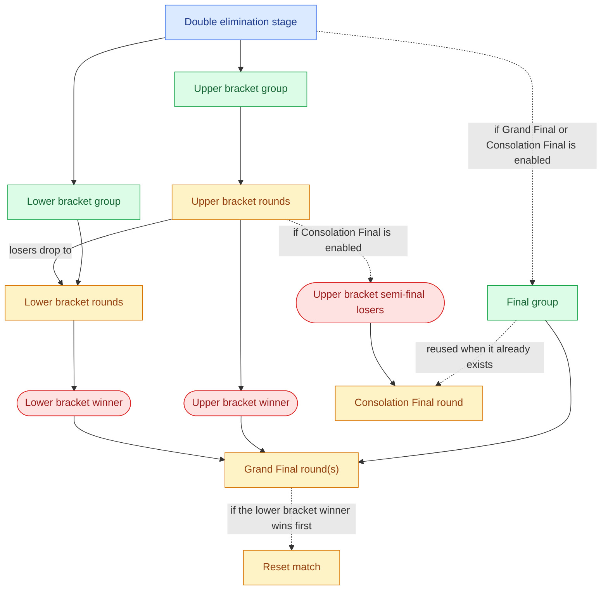

This page explains the structure of a tournament in more details. For the basis, read the [Glossary](glossary.md).

The storage hierarchy is always the same: a stage contains groups, groups contain rounds, and rounds contain matches. Matches can also contain match games when you use Best-Of-X.



| Color                                                                                                                                         | Meaning                             |
| --------------------------------------------------------------------------------------------------------------------------------------------- | ----------------------------------- |
| <span style="display:inline-block; width:0.9rem; height:0.9rem; background:#dbeafe; border:1px solid #2563eb; vertical-align:middle;"></span> | Stage                               |
| <span style="display:inline-block; width:0.9rem; height:0.9rem; background:#dcfce7; border:1px solid #16a34a; vertical-align:middle;"></span> | Group                               |
| <span style="display:inline-block; width:0.9rem; height:0.9rem; background:#fef3c7; border:1px solid #d97706; vertical-align:middle;"></span> | Round                               |
| <span style="display:inline-block; width:0.9rem; height:0.9rem; background:#e2e8f0; border:1px solid #475569; vertical-align:middle;"></span> | Match or match game                 |
| <span style="display:inline-block; width:0.9rem; height:0.9rem; background:#fee2e2; border:1px solid #dc2626; vertical-align:middle;"></span> | Participant outcome (winner/losers) |

## Round-robin

In round-robin stages, each group is a pool, which contains rounds, which contain matches.



## Single elimination

In single elimination stages, there is at least one group (the "unique bracket"), which contains rounds, which contain matches.

The **unique bracket** yields one winner, and multiple losers.

If the stage is configured to have a [Consolation Final](glossary.md#consolation-final), it is also a group with a single round containing a single match, matching both semi-final losers.



## Double elimination

In double elimination stages, there are at least two groups: the upper bracket (a.k.a. "winner bracket") and the lower bracket (a.k.a. "loser bracket"). There may also be a final group for the Grand Final, the Consolation Final, or both.

The **upper bracket** yields one winner, and multiple losers.

The **lower bracket** only yields one winner, which may play in the [Grand Final](glossary.md#grand-final) against the winner of the upper bracket.

If the stage is configured to have a [Grand Final](glossary.md#grand-final), it is also a group with one or two rounds (depending on [`settings.grandFinal`](/brackets-docs/reference/model/interfaces/StageSettings.html#grandFinal)), each containing a single match, matching the winner of the upper bracket and the winner of the lower bracket.

If the WB winner wins, it's the winner of the stage. But if it loses, the final is reset and there is a very last match, known as the [reset match](glossary.md#reset-match). It gives the WB winner the right to lose once during the stage. This is commonly known as "resetting the bracket".

If the stage is configured to have a [Consolation Final](glossary.md#consolation-final), any **existing final group** is reused. For example, a double elimination stage with both a [Grand Final](glossary.md#grand-final) and [Consolation Final](glossary.md#consolation-final) will share the same final group.

For the [Consolation Final](glossary.md#consolation-final), a round is created with a single match, matching both **upper bracket** semi-final losers.

???+ note "Technical detail about the consolation final"
    In order to differentiate the [Grand Final](glossary.md#grand-final) and [Consolation Final](glossary.md#consolation-final) matches which always are `number: 1`, the [Consolation Final](glossary.md#consolation-final) match is arbitrarily set to `number: 2` **although it's the only match in its round**.



## Opponent `position` property in matches

The `position` property in `opponent1` and `opponent2` in a match is used to display the opponent's origin in the UI.

It holds the match number of the match whose winner will fill the current participant slot in the match.

For example, the match `LB 1.1` (loser bracket, round 1, match 1) has the following values:
```json
{
    "opponent1": {
        "id": null, // TBD
        "position": 1
    },
    "opponent2": {
        "id": null, // TBD
        "position": 2
    }
}
```

Although we don't know the opponent IDs yet, we know their source in advance. So in the UI, we show:

| LB 1.1      | Opponents       |
| ----------- | --------------- |
| `opponent1` | Loser of WB 1.1 |
| `opponent2` | Loser of WB 1.2 |
